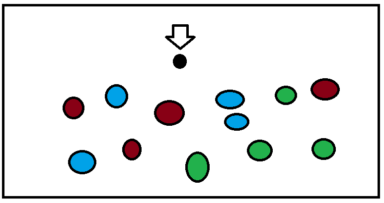
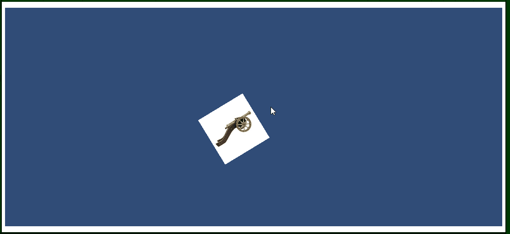

[[# MijnUnityProject

## v00rbereiding

**ik ga een soort plingo game maken die een score bij houd op basis van hoever hij vanaf het midden eidigt**

**week 1 was vrij makkelijk we hebben het vooral gehad over wat we moesten doen en we hebben daar een begin aan gemaakt**

Titel (werktitel)

- bal breaker

Genre

- Physics-based arcade puzzelgame.

Beschrijving

- je aimt en schiet een bal die bumbers breaked

Gameplaykern

- Bal: een sphere
- Targets of bumps: cylinders
- Score: als je een bumber haalt
- Doel: als ej 500 punten hebt 
- Stijl en sfeer
donker thema mogenlijk zwart met regenboog 

Structuur van het level
- Bovenaan: schietplek.
- Midden: veld met targets.
- Onderaan: opvang of doelgebied voor het einde van de beurt.

## les 1

**Ik ben begonnen met de les door naar erwin te luisteren hierna heb ik halverwegen op mezelf gaan werken waarna ik de rest af heb gekregen**

**Ik ben begonnen met een canon afbeelding te vinden en heb die op een empty object toen heb ik de afbeelding verandert naar een sprite die heb ik toen opmijn empty object gezet zodat het een parent object werdt**

**Ik heb daarna hetzelfde gedaan met de bal daar heb ik een prefab van gemaakt zodat ik hem makelijk kan hergebruiken**

**Ik heb 2 scripts gemaakt deze les 1 voor [shoot](assets/scripts/module%202/shoot(peggle).cs) en 1 voor [aim](assets/scripts/module%202/aim(peggle).cs)**

**Ik heb ook een Line-Renderer gemaakt om te laten zien hoe hard je schiet**